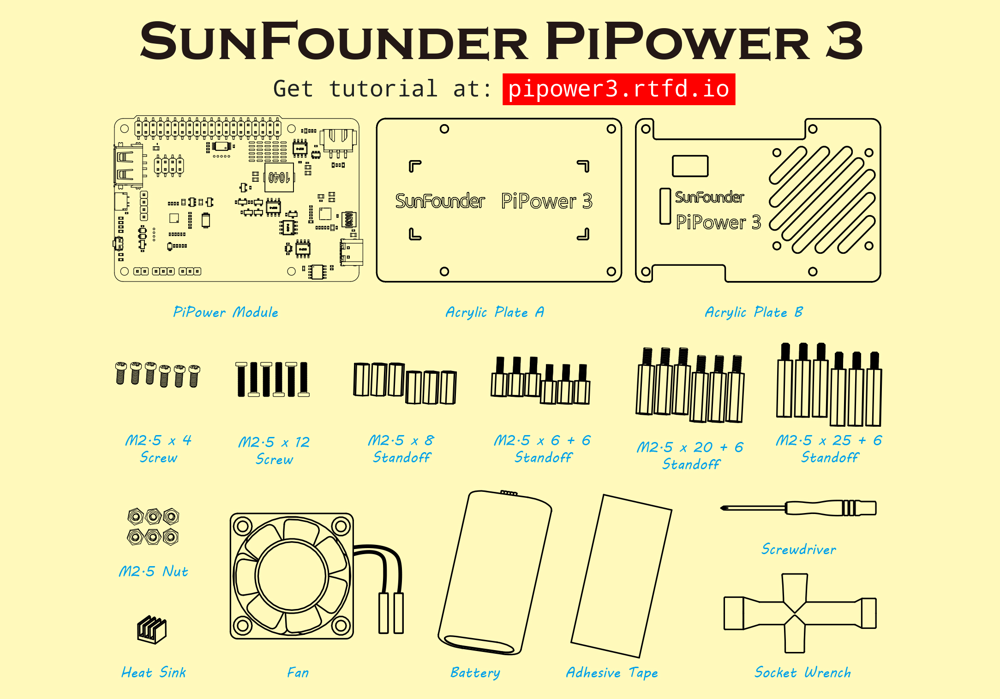
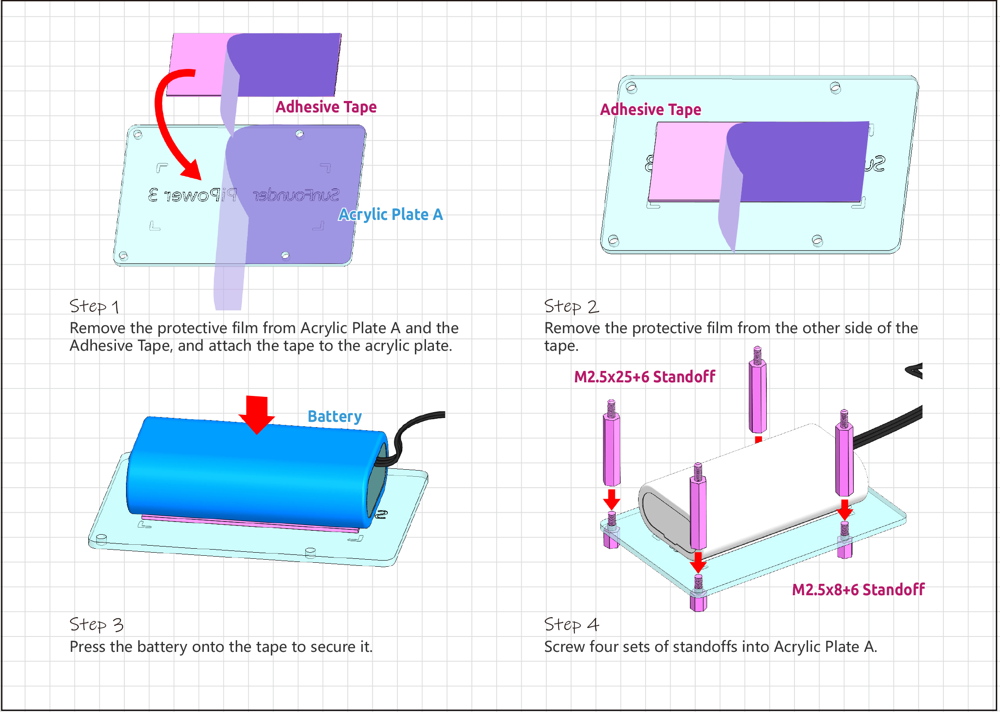
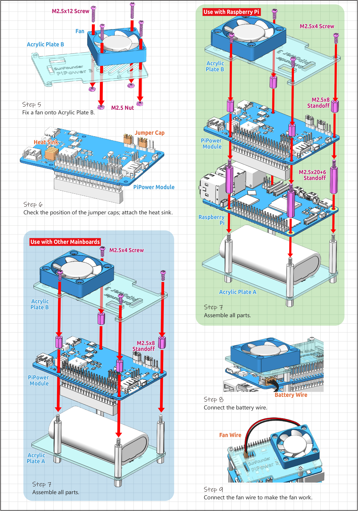

.. note:: 

    ¡Hola, bienvenido a la Comunidad de Entusiastas de SunFounder Raspberry Pi & Arduino & ESP32 en Facebook! Profundiza en Raspberry Pi, Arduino y ESP32 con otros entusiastas.

    **¿Por qué unirse?**

    - **Soporte experto**: Resuelve problemas postventa y desafíos técnicos con la ayuda de nuestra comunidad y equipo.
    - **Aprender y compartir**: Intercambia consejos y tutoriales para mejorar tus habilidades.
    - **Vistas previas exclusivas**: Accede antes que nadie a nuevos anuncios de productos y avances.
    - **Descuentos especiales**: Disfruta de descuentos exclusivos en nuestros productos más nuevos.
    - **Promociones festivas y sorteos**: Participa en sorteos y promociones especiales.

    👉 ¿Listo para explorar y crear con nosotros? Haz clic en [|link_sf_facebook|] y únete hoy mismo!

.. _assembly_instructions:

Instrucciones de Montaje
===========================

Antes de montar el PiPower 3, por favor verifica primero que todas las piezas y componentes estén incluidos. Si falta alguno o están dañados, por favor contacta a SunFounder inmediatamente a service@sunfounder.com para resolver el problema lo antes posible.

