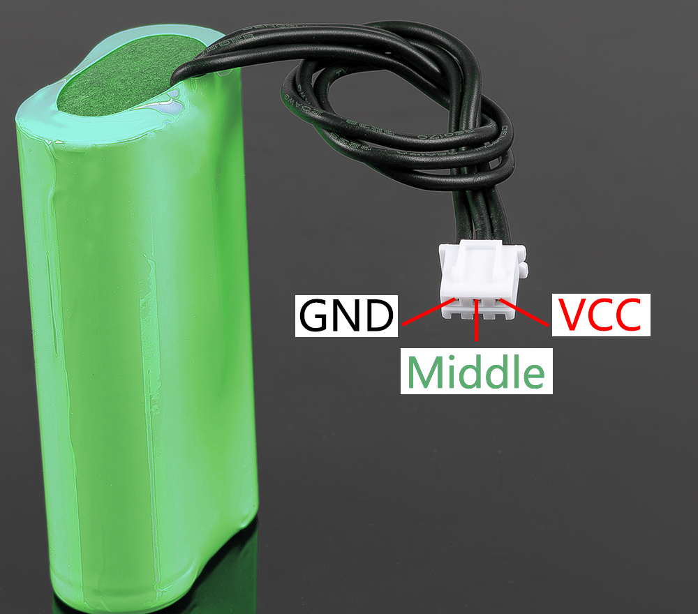

.. note:: 

    ¡Hola, bienvenido a la Comunidad de Entusiastas de SunFounder Raspberry Pi, Arduino y ESP32 en Facebook! Profundiza en Raspberry Pi, Arduino y ESP32 junto a otros entusiastas.

    **¿Por qué unirse?**

    - **Soporte experto**: Resuelve problemas postventa y desafíos técnicos con la ayuda de nuestra comunidad y equipo.
    - **Aprender y compartir**: Intercambia consejos y tutoriales para mejorar tus habilidades.
    - **Avances exclusivos**: Accede anticipadamente a nuevos anuncios de productos y avances.
    - **Descuentos especiales**: Disfruta de descuentos exclusivos en nuestros productos más recientes.
    - **Promociones festivas y sorteos**: Participa en sorteos y promociones durante las fiestas.

    👉 ¿Listo para explorar y crear con nosotros? Haz clic en [|link_sf_facebook|] y únete hoy mismo.

Batería 18650
=================

* **VCC**: Terminal positivo de la batería, aquí hay dos conjuntos de VCC y GND para aumentar la corriente y reducir la resistencia.
* **Medio**: Para equilibrar la tensión entre las dos celdas y proteger la batería.
* **GND**: Terminal negativo de la batería.

Este es un paquete de baterías personalizado fabricado por SunFounder, compuesto por dos baterías 18650 con una capacidad de 2000mAh. El conector es XH2.54 3P, el cual se puede cargar directamente después de ser insertado en el escudo.

**Características**

* **Composición**: Li-ion
* **Capacidad de la batería**: 2000mAh, 14.8Wh
* **Peso de la batería**: 90.8g
* **Número de celdas**: 2
* **Conector**: XH2.54 3 pines
* **Protección contra sobre-descarga**: 6.0V