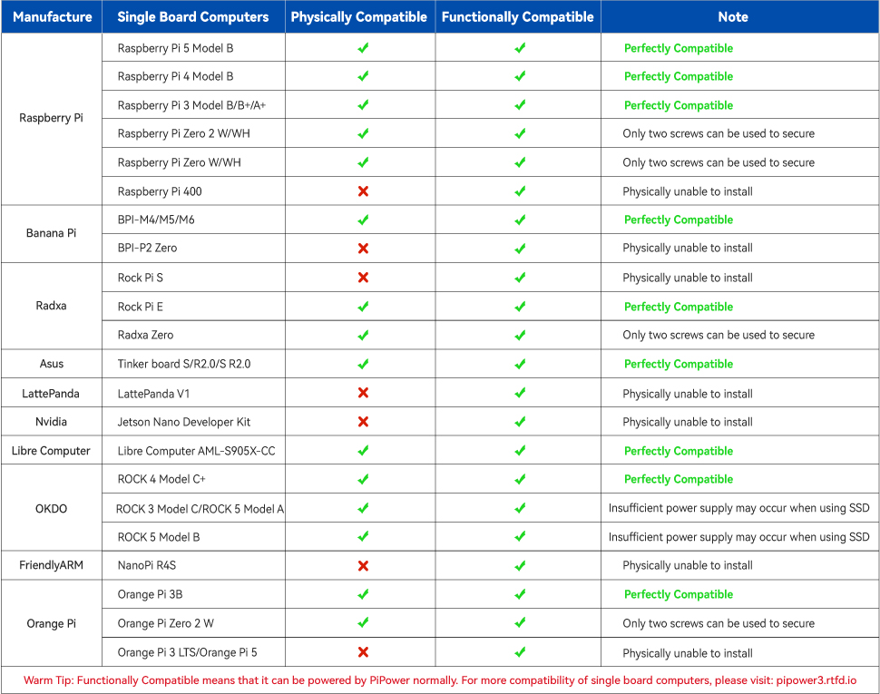

対応するSBC
======================

PiPower 3はさまざまなシングルボードコンピュータ（SBC）に対応しています。構造設置、電源供給、ソフトウェア構成の観点から、Raspberry Piシリーズと完全に互換性があります。

一部のSBCはPiPower 3で電源供給が可能ですが、構造的に互換性がない場合や部分的にしか互換性がない場合があります。例えば、Zeroタイプのボードは2つの取り付け穴しか固定できません。

ソフトウェア構成に関しては、Python、MicroPython、Arduinoなどのプログラミング言語をサポートしています。特定のSBCに基づいて適切な言語を選択する必要があります。

