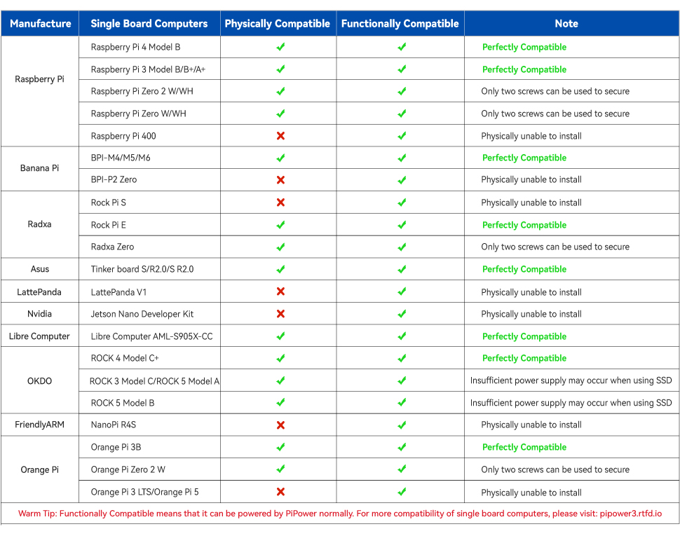

Compatible con SBCs
=========================

PiPower 3 es compatible con varias Computadoras de Placa Única (SBCs). Es completamente compatible con la serie Raspberry Pi en términos de instalación estructural, suministro de energía y configuración de software.

Algunas SBCs pueden ser alimentadas por PiPower 3, pero pueden no ser estructuralmente compatibles o solo parcialmente compatibles. Por ejemplo, las placas de tipo Zero solo pueden fijarse utilizando dos agujeros de montaje.

En cuanto a la configuración de software, ofrecemos soporte para lenguajes de programación como Python, MicroPython y Arduino. Deberás elegir el lenguaje apropiado según tu SBC específica.

