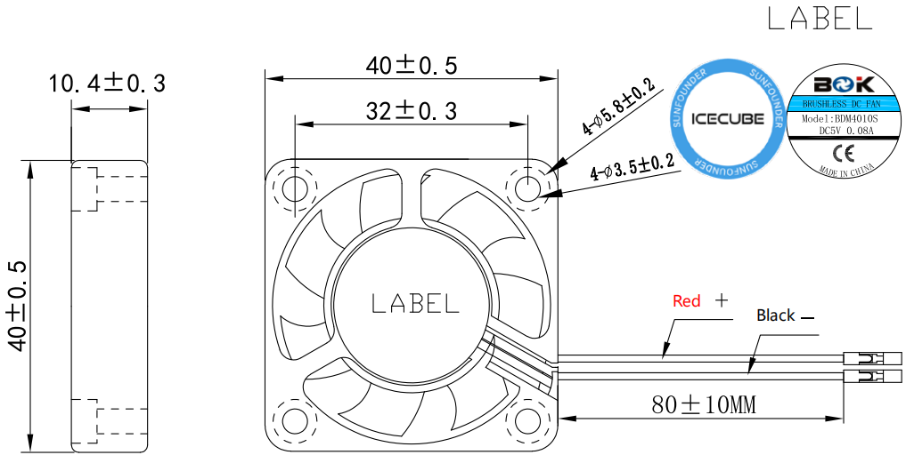

.. note:: 

    ¡Hola, bienvenido a la Comunidad de Entusiastas de SunFounder Raspberry Pi, Arduino y ESP32 en Facebook! Profundiza en Raspberry Pi, Arduino y ESP32 junto a otros entusiastas.

    **¿Por qué unirse?**

    - **Soporte experto**: Resuelve problemas postventa y desafíos técnicos con la ayuda de nuestra comunidad y equipo.
    - **Aprender y compartir**: Intercambia consejos y tutoriales para mejorar tus habilidades.
    - **Avances exclusivos**: Accede anticipadamente a nuevos anuncios de productos y avances.
    - **Descuentos especiales**: Disfruta de descuentos exclusivos en nuestros productos más recientes.
    - **Promociones festivas y sorteos**: Participa en sorteos y promociones durante las fiestas.

    👉 ¿Listo para explorar y crear con nosotros? Haz clic en [|link_sf_facebook|] y únete hoy mismo.

Ventilador
===============

* **Dimensiones externas**: 40*40*10MM
* **Peso**: 13.5±5g/pc
* **Duración**: 40,000 horas (temperatura ambiente 25°C)
* **Flujo de aire máximo**: 2.46CFM
* **Presión máxima de aire**: 0.62mm-H2O
* **Sonido acústico**: 22.31dBA
* **Potencia de entrada nominal**: 5V/0.1A
* **Velocidad nominal**: 3500±10%RPM
* **Temperatura de operación**: -10℃~+70℃
* **Temperatura de almacenamiento**: -30℃~+85℃

