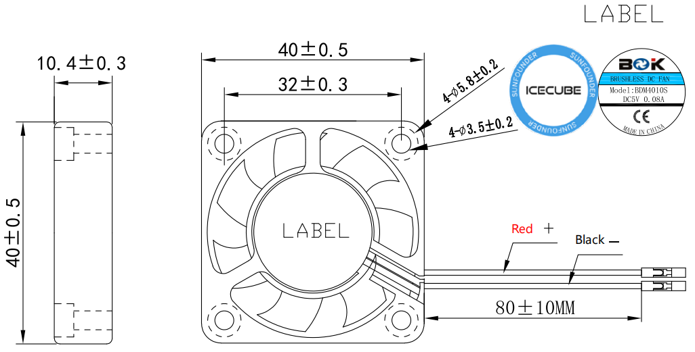

.. note::

    こんにちは、SunFounderのRaspberry Pi & Arduino & ESP32愛好家コミュニティへようこそ！Facebook上でRaspberry Pi、Arduino、ESP32についてもっと深く掘り下げ、他の愛好家と交流しましょう。

    **参加する理由は？**

    - **エキスパートサポート**：コミュニティやチームの助けを借りて、販売後の問題や技術的な課題を解決します。
    - **学び＆共有**：ヒントやチュートリアルを交換してスキルを向上させましょう。
    - **独占的なプレビュー**：新製品の発表や先行プレビューに早期アクセスしましょう。
    - **特別割引**：最新製品の独占割引をお楽しみください。
    - **祭りのプロモーションとギフト**：ギフトや祝日のプロモーションに参加しましょう。

    👉 私たちと一緒に探索し、創造する準備はできていますか？[|link_sf_facebook|]をクリックして今すぐ参加しましょう！

ファン
===============

* **外形寸法**: 40*40*10MM
* **重量**: 13.5±5g/個
* **寿命**: 40,000時間 (室温 25°C)
* **最大風量**: 2.46CFM
* **最大風圧**: 0.62mm-H2O
* **騒音**: 22.31dBA
* **定格入力電力**: 5V/0.1A
* **定格速度**: 3500±10%RPM
* **動作温度**: -10℃~+70℃
* **保管温度**: -30℃~+85℃

