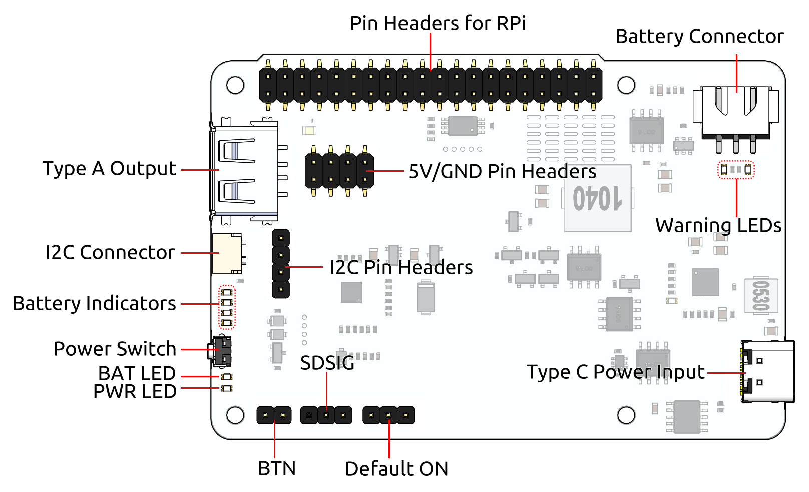
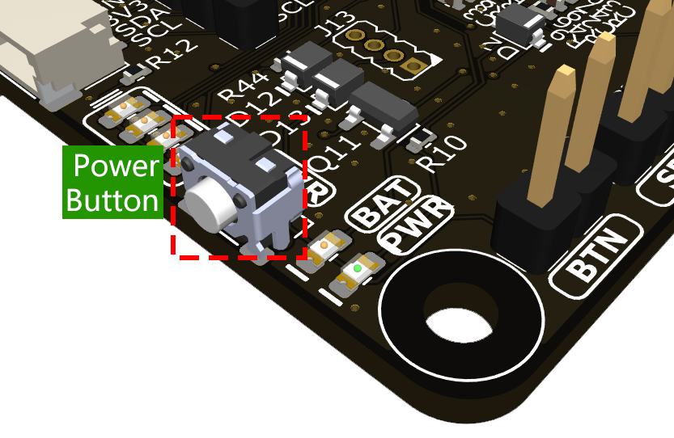
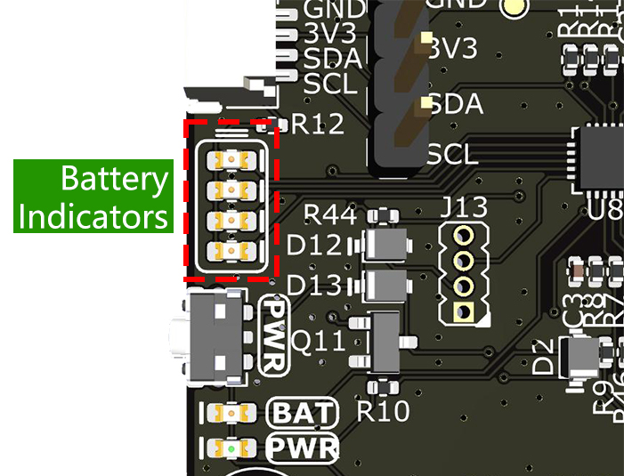
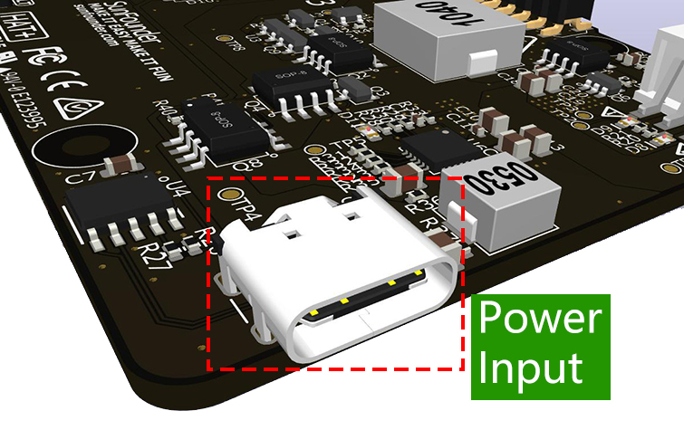
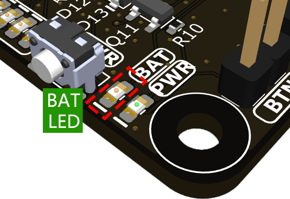
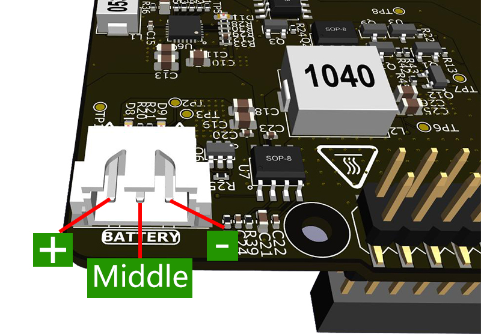
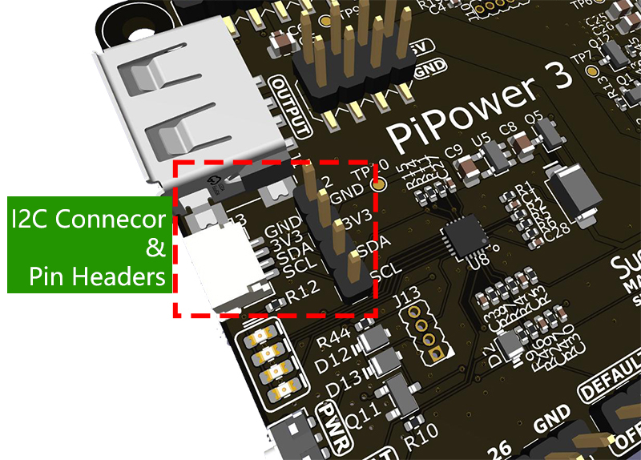
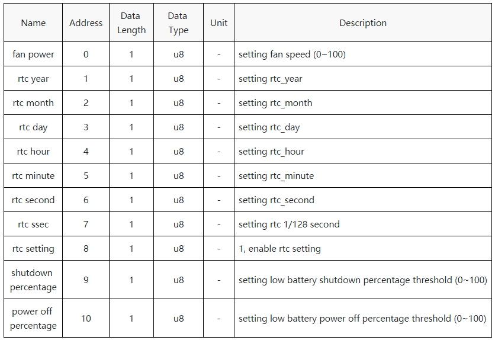
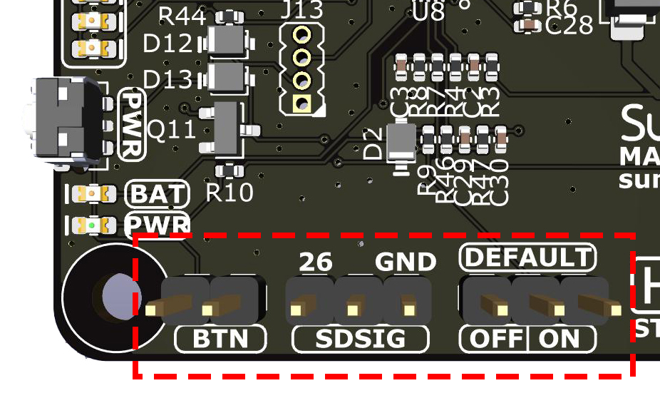
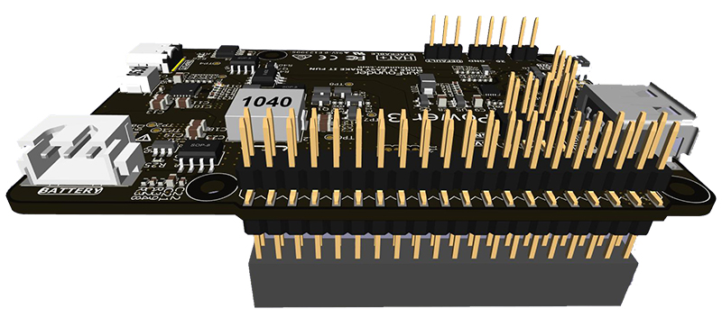

.. note::

    Hallo und willkommen in der SunFounder Raspberry Pi & Arduino & ESP32 Enthusiasten-Gemeinschaft auf Facebook! Tauchen Sie tiefer ein in die Welt von Raspberry Pi, Arduino und ESP32 mit anderen Enthusiasten.

    **Warum beitreten?**

    - **Expertenunterstützung**: Lösen Sie Nachverkaufsprobleme und technische Herausforderungen mit Hilfe unserer Gemeinschaft und unseres Teams.
    - **Lernen & Teilen**: Tauschen Sie Tipps und Anleitungen aus, um Ihre Fähigkeiten zu verbessern.
    - **Exklusive Vorschauen**: Erhalten Sie frühzeitigen Zugang zu neuen Produktankündigungen und exklusiven Einblicken.
    - **Spezialrabatte**: Genießen Sie exklusive Rabatte auf unsere neuesten Produkte.
    - **Festliche Aktionen und Gewinnspiele**: Nehmen Sie an Gewinnspielen und Feiertagsaktionen teil.

    👉 Sind Sie bereit, mit uns zu erkunden und zu erschaffen? Klicken Sie auf [|link_sf_facebook|] und treten Sie heute bei!

Hardware Einführung
========================

Spezifikationstabelle
-----------------------------

.. list-table:: 
   :widths: 30 10 10 10 10

   * - Parameter
     - Min
     - Typisch
     - Max
     - Einheit
   * - Abschaltstrom der Batterie
     - \-
     - \-
     - 60
     - uA
   * - Ruhestrom der Batterie
     - \-
     - 25
     - \-
     - mA
   * - DC-DC Ausgangsspannung
     - 5,1957
     - 5,2855
     - 5,3766
     - V
   * - Übertemperaturschutz DC-DC
     - \-
     - 150
     - \-
     - ℃
   * - Ladestrom der Batterie
     - \-
     - \-
     - 1
     - A
   * - Übertemperaturschutz beim Laden
     - \-
     - 135
     - \-
     - ℃
   * - Eingangsschwelle für Niederspannungsschaltung
     - 4,54
     - 4,63
     - 4,72
     - V
   * - Ausgleichsstrom
     - \-
     - 40
     - \-
     - mA
   * - Aktivierungsspannung des Ausgleichs
     - \-
     - 4,1
     - \-
     - V

Übersichtsdiagramm
---------------------

1. :ref:`power_input`: Externer Stromeingang, kann den Raspberry Pi direkt mit Strom versorgen und gleichzeitig die Batterie laden.
2. :ref:`cap_onoff`: Wählen Sie, ob das Gerät automatisch starten soll, wenn der externe Stromeingang im ausgeschalteten Zustand eingesteckt wird.
3. :ref:`cap_sdsig`: Abschaltsignal, der Anschluss von Pin 26 an den mittleren Pin mit einer Jumperkappe verbindet **SDSIG** mit GPIO26 auf dem Raspberry Pi. Sobald konfiguriert, wenn der Raspberry Pi herunterfährt, wird GPIO26 hoch und signalisiert PiPower 3, das Gerät auszuschalten.
4. :ref:`cap_btn`: Externer Netzschalter-Jumper, wird für den externen Netzschalter verwendet.
5. **PWR LED**: Ausgangsstatus-LED, leuchtet, wenn der Ausgang aktiviert ist.
6. **BAT LED**: Die LED leuchtet auf, wenn die Batterie derzeit Strom liefert. In diesem Fall müssen Sie den Batteriestand überwachen, um Schäden durch Tiefentladung zu vermeiden.
7. :ref:`power_button`: Eingebauter Netzschalter zur Steuerung der Stromversorgung der Platine:

  * **Einmal drücken**: Aktiviert den Ausgang.
  * **2 Sekunden lang gedrückt halten, bis die mittleren beiden Batterie-LEDs aufleuchten, dann loslassen**: Sendet eine Abschaltanforderung über I2C.
  * **Weiter gedrückt halten für mehr als 5 Sekunden**: Schaltet den Ausgang direkt aus.

8. :ref:`battery_indicators`: Zeigt den Batteriestand und den Ladestatus an.
9. **I2C Anschluss**: SH1.0 4P Terminal, kompatibel mit **qwIIC** und **STEMMA QT**.
10. **I2C Pin Header**: 1x4P 2.54 Pin-Header.
11. **Type A Ausgang**: 5V Ausgangsschnittstelle.
12. **5V/GND Pin Header**: 2 x 4P 2.54 Pin-Header.
13. :ref:`pin_header`: Raspberry Pi Pin-Header, direkt mit dem Raspberry Pi verbunden.
14. :ref:`battery_connector`: XH2.54 3P Batterieanschluss.
15. **Warn-LEDs**: Wenn die Batterie falsch herum eingesetzt ist, leuchten zwei rote LEDs auf, um vor der Verpolung der Batterie zu warnen.

.. _power_button:

Netzschalter
----------------

Eingebauter Netzschalter zur Steuerung der Stromversorgung der Platine:

* **Einmal drücken**: Aktiviert den Ausgang.
* **2 Sekunden lang gedrückt halten, bis die mittleren beiden Batterie-LEDs aufleuchten, dann loslassen**: Sendet eine Abschaltanforderung über i2c.
* **Weiter gedrückt halten für mehr als 5 Sekunden**: Schaltet den Ausgang direkt aus.

.. _battery_indicators:

Batterieanzeige
--------------------------------

Vier eingebaute LEDs zeigen den Batteriestand und den Ladestatus an. Beachten Sie, dass die Anzeigelampe auch bei ausgeschaltetem Zustand während des Ladevorgangs den Ladestatus anzeigt, bis der Ladevorgang abgeschlossen ist.

* **4 LEDs leuchten**: Batterie >80%
* **3 LEDs leuchten**: 60%< Batterie <80%
* **2 LEDs leuchten**: 40%< Batterie <60%
* **1 LED leuchtet**: 20%< Batterie <40%
* **Erste LED blinkt**: Batterie <20%
* **LEDs leuchten zyklisch auf**: Laden
* **Mittlere zwei LEDs blinken**: Warten auf Abschaltsignal
* **Alle LEDs aus**: Stromlos oder im Schlafmodus

.. _power_input:

Stromeingang
--------------

Wenn Sie den Raspberry Pi 5 verwenden, sollte der Stromeingang eine USB PD-Quelle mit 5V/5A unterstützen, wie die offizielle Raspberry Pi 27W Stromquelle (empfohlen). Andernfalls kann die Batterie bei hohem Stromverbrauch möglicherweise nicht geladen werden oder sogar entladen werden, bis die Batterie nicht mehr ausreichend Strom liefern kann.

Die **BAT LED** kann bestätigen, ob die Batterie derzeit externen Strom liefert, um die Batteriesicherheit zu gewährleisten und die Batterie bei einem Stromausfall als USV zu verwenden.

**Strompfad**

PiPower 3 integriert die Strompfadfunktion und schaltet automatisch die Strompfade um, um den Batterieverschleiß zu reduzieren und nahtlos umzuschalten.

* Bei angeschlossenem externen Strom kommt der 5V Ausgang direkt vom externen 5V, der abgeschaltet werden kann. Wenn die Bedingungen es zulassen, wird die Batterie auch extern geladen (siehe Ladestrom).
* Bei getrenntem Strom schaltet das System automatisch auf die Batteriestromversorgung um und schützt das System nahtlos bei einem Stromausfall.

Die **BAT LED** kann bestätigen, ob die Batterie derzeit externen Strom liefert.

.. _battery_connector:

Batterieanschluss
------------------------
XH2.54 3P Batterieanschluss.

Laderelevantes
-------------------

**Ladestrom**

Der maximale Ladestrom passt sich basierend auf der Eingangsspannung an, um eine maximale Stromversorgung des Raspberry Pi zu gewährleisten.

* Bei eingeschaltetem Zustand passt sich der Ladestrom dynamisch basierend auf der Eingangsspannung an. Der maximale Ladestrom beträgt 1A; wenn die Eingangsspannung unter 4,63V liegt, wird dies als unzureichende Stromversorgung betrachtet und das Laden wird deaktiviert. Zwischen 4,63V-5,2V passt das System den Ladestrom automatisch an, um sicherzustellen, dass die Eingangsspannung über 4,63V liegt.
* Bei ausgeschaltetem Zustand beträgt der Ladestrom 1A.

**Ladeprozess**

* Wenn die Gesamtspannung der Batterie weniger als 3,7V beträgt, wird die Batterie mit 50mA geladen.
* Wenn die Gesamtspannung der Batterie zwischen 3,7V und 6V liegt, wird die Batterie mit 100mA geladen.
* Wenn die Gesamtspannung der Batterie 6V überschreitet, wird die Batterie mit dem eingestellten maximalen Ladestrom geladen;
* Wenn die Gesamtspannung der Batterie 8,4V erreicht, wechselt sie in den Konstantspannungs-Lademodus.
* Nach vollständiger Aufladung der Batterie und fortgesetzter Eingabe, wenn die Gesamtspannung der Batterie weniger als 8V beträgt, wird der Ladevorgang neu gestartet;
* Im Konstantspannungsmodus, wenn der Ladestrom weniger als 200mA beträgt, wird das Laden nach 30s gestoppt, überprüft, ob die Batteriespannung über der Stoppladespannung liegt; wenn ja, wird das Laden gestoppt, wenn nicht, wird das Laden fortgesetzt und nach 30s erneut überprüft.

**Ladeausgleichsfunktion**

Während des Ladevorgangs überwacht der Ladechip ständig die Spannung der beiden Batteriezellen. Wenn eine Zellenspannung die Aktivierungsspannung des Ausgleichs von 4,1V erreicht, wird der entsprechende interne Ausgleichs-MOS aktiviert und reduziert den Ladestrom für diese Zelle.

Bedingungen für das Abschalten des Ausgleichs:

#. Beide Zellenspannungen sind über der Aktivierungsspannung des Ausgleichs von 4,1V;
#. Beenden des normalen Ladevorgangs (z.B. NTC-Schutz, Eingangsspannung überhöht, Batterie vollständig geladen);

**Temperaturschutz**

* Wenn die Innentemperatur des Ladechips 135 Grad überschreitet, wird das Laden zwangsweise gestoppt;
* Wenn die Innentemperatur des DC-DC-Chips 150 Grad überschreitet, wird der DC-DC abgeschaltet;

MCU I2C-Kommunikation
-------------------------------

I2C-Adresse: 0x5a

Der integrierte MCU sammelt verschiedene Signale von der Platine und speichert sie in Registern, auf die über I2C zugegriffen werden kann.

* :download:`Registertabelle </_static/pdf/Register Table.pdf>`

Registertabelle einstellen:

.. _cap_onoff:

Standardmäßig EIN/AUS
----------------------

Dieser **EIN/AUS**-Jumper wird verwendet, um auszuwählen, ob der Ausgang standardmäßig aktiviert wird, wenn die USB-Stromversorgung nach dem Herunterfahren eingesteckt wird.

* Wenn die Jumper-Kappe links ist, verbunden mit AUS, wird das Einstecken der USB-Stromversorgung nach dem Herunterfahren den Ausgang nicht aktivieren.
* Wenn die Jumper-Kappe rechts ist, verbunden mit EIN, wird das Einstecken der USB-Stromversorgung nach dem Herunterfahren den Ausgang aktivieren.

Diese Funktion wird typischerweise für Geräte verwendet, die standardmäßig eingeschaltet sein müssen, wie private Server: Bei einem Stromausfall weist PiPower 3 den Raspberry Pi an, herunterzufahren. Beim nächsten Stromversorgungszyklus aktiviert PiPower 3 automatisch den Ausgang und schaltet den Raspberry Pi ein, wodurch manuelle Eingriffe überflüssig werden.

Diese Funktion kann auch als Fern-Ein/Aus-Funktion verwendet werden. Schließen Sie den Eingang an eine intelligente Steckdose oder einen intelligenten Schalter an. Stellen Sie den Abschaltprozentsatz auf 100 %. Wenn ein Fernabschalten erforderlich ist, steuern Sie die intelligente Steckdose direkt, um die Stromversorgung zu unterbrechen. PiPower 3 erkennt den Stromausfall, benachrichtigt den Raspberry Pi zum Herunterfahren und unterbricht dann die Stromversorgung. Wenn ein Fern-Einschalten erforderlich ist, schalten Sie den intelligenten Schalter direkt ein. PiPower erkennt die Stromversorgung, schaltet standardmäßig ein und kann den Raspberry Pi starten, um eine Fernsteuerung des Ein- und Ausschaltens zu ermöglichen.

.. _cap_btn:

BTN
---------

Dieser **BTN**-Jumper ist für einen externen Netzschalter. Wenn Sie PiPower 3 in ein Gehäuse einbauen müssen, können Sie möglicherweise den eingebauten Netzschalter nicht drücken. In diesem Fall benötigen Sie einen externen Schalter zum Ein- und Ausschalten der Stromversorgung. Schließen Sie einen selbstsichernden Schalter an den Jumper an, der ein Taster oder ein Vintage-Metallschalter sein kann. Nach dem Anschließen können Sie den externen Schalter wie den eingebauten Schalter drücken.

.. _cap_sdsig:

SDSIG
------------

Das **SDSIG**-Abschaltsignal umfasst drei Pins: Pin 26, einen mittleren Pin und einen rechten GND-Pin.

* Wenn Sie Pin 26 mit dem mittleren Pin über eine Jumperkappe verbinden, wird SDSIG mit GPIO26 auf dem Raspberry Pi verbunden. Nach der Konfiguration, wenn der Raspberry Pi herunterfährt, wird der GPIO26-Pin auf High gezogen, was anzeigt, dass SDSIG auf High steht und PiPower 3 zum Ausschalten auffordert.
* Wenn diese Funktion nicht benötigt wird, wie bei einem Einplatinencomputer wie Arduino oder Raspberry Pi Pico, sollte die Jumperkappe mit GND verbunden werden.

**SDSIG** ist der Abschaltsignalpin. Das Ziehen dieses Pins auf High zeigt an, dass der Host heruntergefahren ist und ausgeschaltet werden muss. Das Ziehen auf Low zeigt an, dass der Host eingeschaltet ist. Wenn diese Funktion nicht benötigt wird, wie bei einem Einplatinencomputer wie Arduino oder Raspberry Pi Pico, sollte die Jumperkappe mit GND verbunden werden. Wenn Sie einen Raspberry Pi verwenden, verbinden Sie die Jumperkappe mit Pin 26, installieren Sie die Software ``pipower3`` auf dem Raspberry Pi, und wenn der Raspberry Pi herunterfährt, wird dieser Pin auf High gezogen, was PiPower 3 zum Ausschalten auffordert.

.. _pin_header:

Pin-Header für RPi
---------------------------

Raspberry Pi Pin-Header, direkt verbunden mit dem Raspberry Pi, einschließlich I2C und Stromversorgung, siehe Raspberry Pi Pin-Diagramm. Header können verwendet werden, um HATs zu stapeln, aber beachten Sie, dass I2C und Pin 26 verbunden sind.

.. list-table::
   :widths: 15 15
   :header-rows: 1

   * - Raspberry Pi
     - MCU an Bord
   * - SDA
     - SDA
   * - SCL
     - SCL
   * - GPIO26
     - SHUTDOWN
   * - ID_SD
     - ID_EEPROM SDA
   * - ID_SC
     - ID_EEPROM SCL
