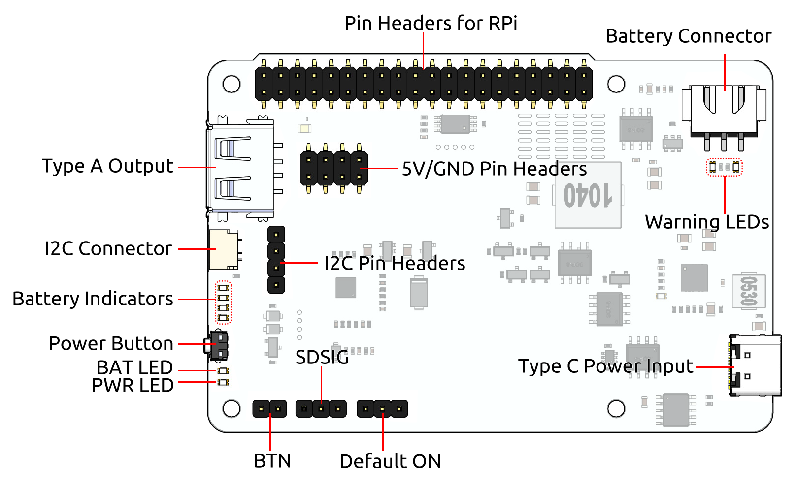
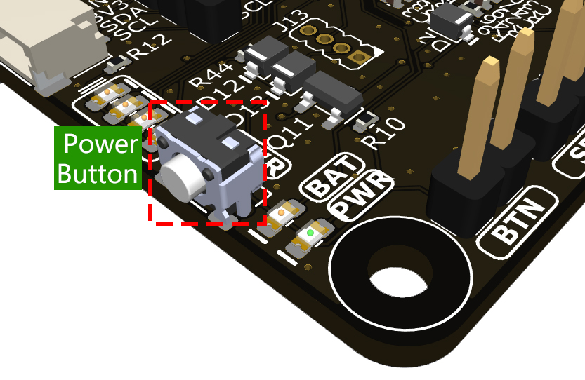
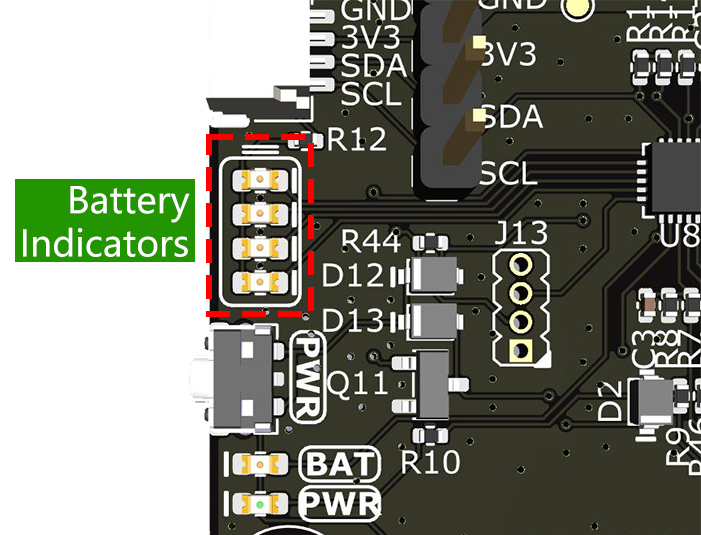
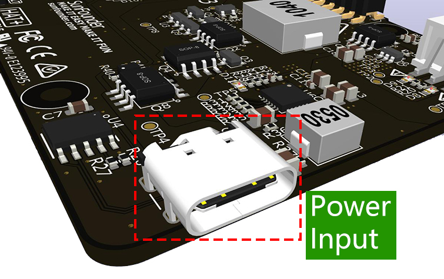
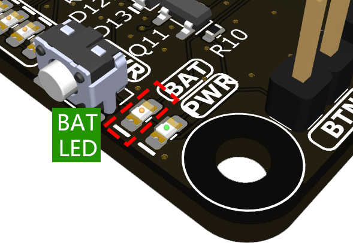
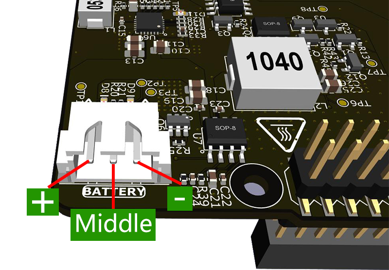
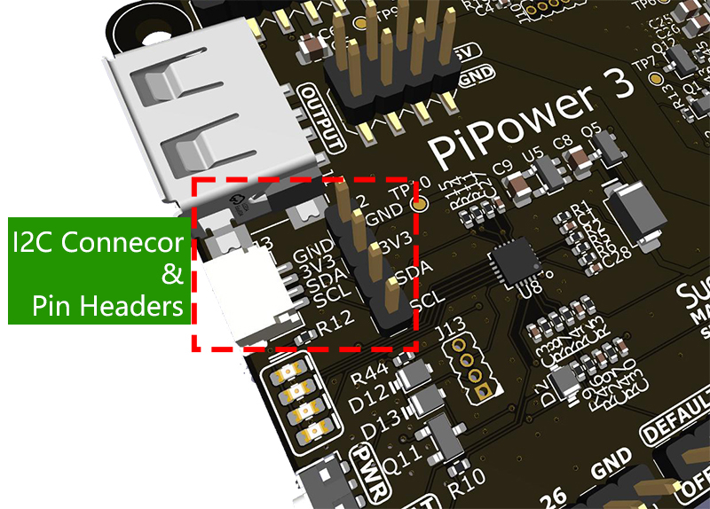
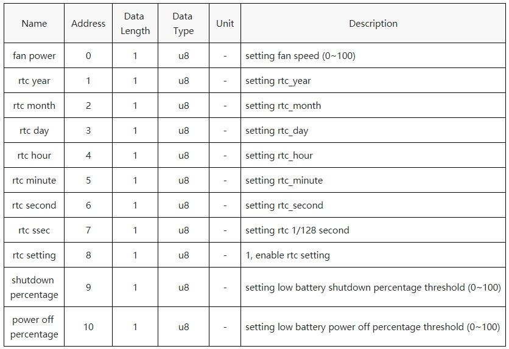
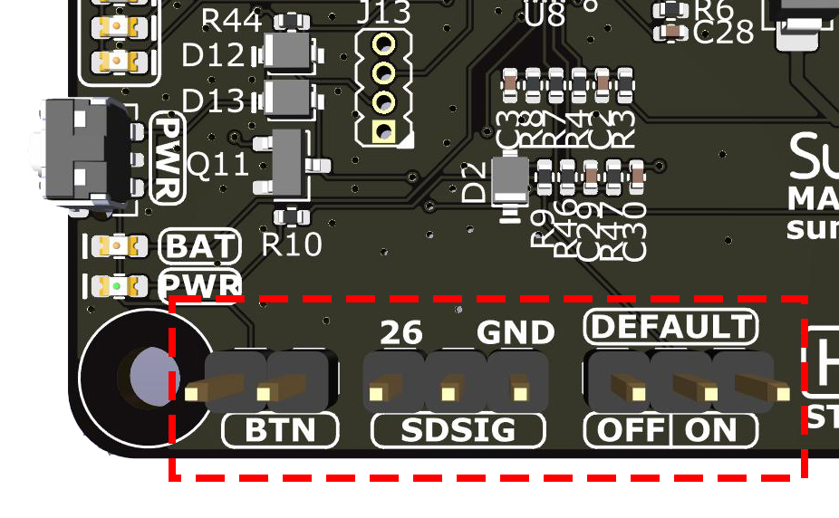
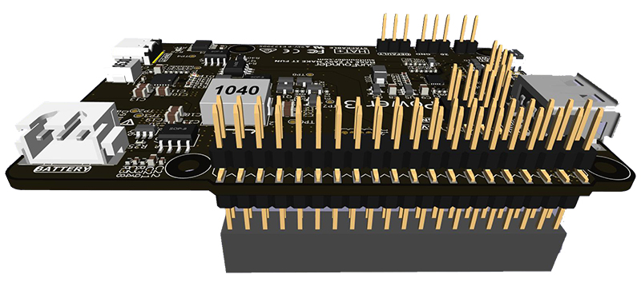

.. note:: 

    Bonjour et bienvenue dans la communauté des passionnés de Raspberry Pi, Arduino et ESP32 de SunFounder sur Facebook ! Plongez plus profondément dans l'univers du Raspberry Pi, Arduino et ESP32 avec d'autres passionnés.

    **Pourquoi nous rejoindre ?**

    - **Support d'experts** : Résolvez vos problèmes après-vente et défis techniques grâce à l'aide de notre communauté et de notre équipe.
    - **Apprendre et partager** : Échangez des astuces et des tutoriels pour améliorer vos compétences.
    - **Aperçus exclusifs** : Accédez en avant-première aux nouvelles annonces de produits et aperçus.
    - **Réductions spéciales** : Profitez de réductions exclusives sur nos derniers produits.
    - **Promotions festives et concours** : Participez à des concours et promotions pendant les fêtes.

    👉 Prêt à explorer et créer avec nous ? Cliquez sur [|link_sf_facebook|] et rejoignez-nous dès aujourd'hui !

Introduction au matériel
==========================

Tableau des spécifications
-----------------------------

.. list-table:: 
   :widths: 30 10 10 10 10

   * - Paramètre
     - Min
     - Typique
     - Max
     - Unité
   * - Courant d'arrêt de la batterie
     - \-
     - \-
     - 60
     - uA
   * - Courant de repos de la batterie
     - \-
     - 25
     - \-
     - mA
   * - Tension de sortie DC-DC
     - 5.1957
     - 5.2855
     - 5.3766
     - V
   * - Protection contre la surchauffe DC-DC
     - \-
     - 150
     - \-
     - ℃
   * - Courant de charge de la batterie
     - \-
     - \-
     - 1
     - A
   * - Protection contre la surchauffe de la charge
     - \-
     - 135
     - \-
     - ℃
   * - Seuil de commutation de faible tension d'entrée
     - 4.54
     - 4.63
     - 4.72
     - V
   * - Courant d'équilibrage
     - \-
     - 40
     - \-
     - mA
   * - Tension d'activation de l'équilibrage
     - \-
     - 4.1
     - \-
     - V

Diagramme de vue d'ensemble
------------------------------

1. :ref:`power_input` : Entrée d'alimentation externe, peut directement alimenter le Raspberry Pi tout en chargeant la batterie.
2. :ref:`cap_onoff` : Sélectionne si l'appareil doit démarrer automatiquement lorsque l'alimentation externe est branchée pendant l'arrêt.
3. :ref:`cap_sdsig` : Signal d'arrêt, connecter le pin 26 au pin central avec un cavalier pour connecter **SDSIG** à GPIO26 sur le Raspberry Pi. Une fois configuré, si le Raspberry Pi s'éteint, GPIO26 devient haut, signalant à PiPower 3 de s'éteindre.
4. :ref:`cap_btn` : Cavalier pour bouton d'alimentation externe, utilisé pour un bouton d'alimentation externe.
5. **PWR LED** : LED d'état de sortie, s'allume lorsque la sortie est activée.
6. **BAT LED** : La LED allumée indique que la batterie fournit actuellement de l'énergie. À ce moment-là, vous devez surveiller le niveau de la batterie pour éviter des dommages dus à une décharge excessive.
7. :ref:`power_button` : Bouton d'alimentation sur la carte pour contrôler l'alimentation de la carte :

   * **Pression simple** : Active la sortie.
   * **Maintenir pendant 2 secondes, jusqu'à ce que les deux LED de batterie du milieu s'allument, puis relâcher** : Envoie une demande d'arrêt via I2C.
   * **Maintenir pendant plus de 5 secondes** : Éteint directement la sortie.

8. :ref:`battery_indicators` : Indique le niveau de la batterie et l'état de la charge.
9. **Connecteur I2C** : Connecteur SH1.0 4P, compatible avec **qwIIC** et **STEMMA QT**.
10. **Broches I2C** : Broches 1x4P 2.54.
11. **Sortie Type A** : Interface de sortie 5V.
12. **Broches 5V/GND** : 2 x 4P 2.54 broches.
13. :ref:`pin_header` : Broches du Raspberry Pi, se connecte directement au Raspberry Pi.
14. :ref:`battery_connector` : Connecteur de batterie XH2.54 3P.
15. **LEDs d'avertissement** : Si la batterie est inversée, deux LED rouges s'allument, signalant une inversion de la batterie.

.. _power_button:

Bouton d'alimentation
------------------------

Bouton d'alimentation sur la carte pour contrôler l'alimentation de la carte :

* **Pression simple** : Active la sortie.
* **Maintenir pendant 2 secondes, jusqu'à ce que les deux LED de batterie du milieu s'allument, puis relâcher** : Envoie une demande d'arrêt via I2C.
* **Maintenir pendant plus de 5 secondes** : Éteint directement la sortie.

.. _battery_indicators:

Indicateurs de batterie
--------------------------------

Quatre LED sur la carte indiquent le niveau de la batterie et l'état de la charge. Notez que si la charge est en cours pendant l'arrêt, l'indicateur de lumière affichera toujours l'état de la charge jusqu'à ce que celle-ci soit terminée.

* **4 LED allumées** : Batterie >80%
* **3 LED allumées** : 60%< Batterie <80%
* **2 LED allumées** : 40%< Batterie <60%
* **1 LED allumée** : 20%< Batterie <40%
* **Première LED clignotante** : Batterie <20%
* **Les LED s'allument progressivement dans un cycle** : En charge
* **Les deux LED du milieu clignotent** : Attente du signal d'arrêt
* **Toutes les LED éteintes** : Hors tension ou en mode veille

.. _power_input:

Entrée d'alimentation
-----------------------

Si vous utilisez le Raspberry Pi, l'entrée d'alimentation doit utiliser une source USB PD supportant 5V/3A, comme la source d'alimentation officielle Raspberry Pi 27W (recommandée). Sinon, en cas de forte consommation d'énergie, la batterie peut ne pas se charger ou même se vider jusqu'à ce qu'elle ne puisse plus fournir d'énergie.

La **BAT LED** permet de vérifier si la batterie fournit actuellement de l'énergie à l'extérieur pour assurer la sécurité de la batterie et garantir qu'elle reste alimentée en cas de panne de courant, agissant comme une alimentation sans interruption (UPS).

**Chemin de l'alimentation**

Le PiPower 3 intègre une fonctionnalité de chemin de l'alimentation, permettant de commuter automatiquement les chemins d'alimentation pour réduire l'usure de la batterie et assurer une transition fluide de l'alimentation.

* Avec une alimentation externe connectée, la sortie 5V provient directement de l'alimentation externe, qui peut être éteinte. Si les conditions le permettent, l'alimentation externe charge également la batterie (voir courant de charge).
* Lorsque l'alimentation est déconnectée, le système passe automatiquement à la sortie abaisseur de la batterie pour l'alimentation, passant sans interruption pour protéger le système lors d'une coupure de courant.

La **BAT LED** permet de vérifier si la batterie fournit actuellement de l'énergie à l'extérieur.

.. _battery_connector:

Connecteur de batterie
---------------------------
Connecteur de batterie XH2.54 3P.

Chargement
-------------

**Courant de charge**

Le courant de charge maximal s'ajuste en fonction de la tension d'entrée pour assurer un maximum d'alimentation pour le Raspberry Pi.

* Lors de la mise sous tension, le courant de charge s'ajuste dynamiquement en fonction de la tension d'entrée. Le courant de charge maximal est de 1A ; si la tension d'entrée est inférieure à 4.63V, elle est considérée comme insuffisante et la charge sera désactivée. Entre 4.63V et 5.2V, le système ajuste automatiquement le courant de charge pour garantir que la tension d'entrée reste supérieure à 4.63V.
* Lors de la mise hors tension, le courant de charge est de 1A.

**Processus de charge**

* Lorsque la tension totale de la batterie est inférieure à 3.7V, la batterie est chargée à 50mA.
* Lorsque la tension totale de la batterie est comprise entre 3.7V et 6V, la batterie est chargée à 100mA.
* Lorsque la tension totale de la batterie dépasse 6V, la batterie est chargée avec le courant de charge maximal défini ;
* Lorsque la tension totale de la batterie approche de 8.4V, elle entre en mode de charge à tension constante.
* Après que la batterie soit complètement chargée et que l'entrée continue, si la tension totale de la batterie est inférieure à 8V, la charge redémarre ;
* En mode de tension constante, si le courant de charge est inférieur à 200mA, la charge s'arrête après 30s, vérifiant si la tension de la batterie est supérieure à la tension d'arrêt de charge ; si c'est le cas, la charge s'arrête, sinon la charge continue et sera vérifiée à nouveau après 30s.

**Fonction d'équilibrage de charge**

Pendant la charge, le circuit de charge surveille constamment la tension des deux cellules de la batterie. Lorsque la tension d'une cellule atteint la tension d'activation de l'équilibrage de 4.1V, le MOS interne correspondant est activé, réduisant le courant de charge pour cette cellule.

Conditions d'arrêt de l'équilibrage :

#. Les deux tensions de cellules de la batterie sont supérieures à la tension d'activation de l'équilibrage de 4.1V ;
#. Sortie du statut de charge normal (par exemple, protection NTC, survoltage d'entrée, batterie complètement chargée) ;

**Protection thermique**

* Lorsque la température interne du circuit de charge dépasse 135 degrés, la charge sera arrêtée de manière forcée ;
* Lorsque la température interne du circuit DC-DC dépasse 150 degrés, le DC-DC sera arrêté ;

Communication I2C du MCU
----------------------------

Adresse I2C : 0x5a

Le MCU embarqué collecte divers signaux de la carte et les stocke dans des registres, qui peuvent être accédés via I2C.

* :download:`Register Table </_static/pdf/Register Table.pdf>`

Tableau des registres définis :

.. _cap_onoff:

ON/OFF par défaut
----------------------

Ce cavalier **ON/OFF** est utilisé pour sélectionner : si la sortie est activée par défaut lorsque l'alimentation USB est branchée après l'arrêt.

* Si le cavalier est à gauche, connecté à OFF, alors insérer l'alimentation USB après l'arrêt n'activera pas la sortie.
* Si le cavalier est à droite, connecté à ON, alors insérer l'alimentation USB après l'arrêt activera la sortie.

Cette fonctionnalité est généralement utilisée pour les appareils devant être allumés par défaut, comme les serveurs privés : lorsqu'il y a une coupure de courant, PiPower 3 ordonne au Raspberry Pi de s'arrêter. En attendant la prochaine alimentation, PiPower 3 active automatiquement la sortie, allumant le Raspberry Pi, éliminant ainsi le besoin d'une intervention manuelle.

Cette fonction peut également être utilisée comme une fonction d'allumage/extinction à distance. Connectez l'entrée à une prise intelligente ou un interrupteur intelligent. Réglez le pourcentage d'arrêt à 100 %. Lorsque l'arrêt à distance est nécessaire, contrôlez directement la prise intelligente pour couper l'alimentation, PiPower 3 détecte la panne de courant, notifie le Raspberry Pi de s'arrêter, puis coupe l'alimentation. Lorsque l'alimentation à distance est nécessaire, allumez directement l'interrupteur intelligent, PiPower détecte l'alimentation, par défaut l'alimentation est activée, et peut démarrer le Raspberry Pi, permettant ainsi un contrôle à distance de l'alimentation.

.. _cap_btn:

BTN
---------

Ce cavalier **BTN** est pour un bouton d'alimentation externe. Si vous devez installer PiPower 3 à l'intérieur d'un boîtier, vous ne pourrez peut-être pas appuyer sur le bouton d'alimentation intégré. À ce moment-là, vous aurez besoin d'un bouton externe pour allumer et éteindre l'alimentation. Connectez un interrupteur auto-récupérant au cavalier, qui peut être un interrupteur tactile ou un bouton métallique vintage. Après la connexion, vous pouvez appuyer sur le bouton externe comme sur le bouton intégré.

.. _cap_sdsig:

SDSIG
------------

Le signal d'arrêt **SDSIG** implique trois broches : la broche 26, une broche centrale, et une broche GND à droite.

* Si vous connectez la broche 26 à la broche centrale avec un cavalier, SDSIG sera connecté à GPIO26 sur le Raspberry Pi. Une fois configuré, si le Raspberry Pi s'éteint, la broche GPIO26 sera mise en haut, indiquant que SDSIG est à un niveau élevé, signalant à PiPower 3 de s'éteindre.
* Si cette fonction n'est pas nécessaire, comme pour un ordinateur monocarte tel qu'Arduino ou Raspberry Pi Pico, le cavalier doit être connecté à GND.

**SDSIG** est la broche de signal d'arrêt. Tirer cette broche à un niveau élevé indique que l'hôte est éteint et doit être mis hors tension. La tirer à un niveau bas indique que l'hôte est sous tension. Si cette fonction n'est pas nécessaire, comme avec un ordinateur monocarte tel qu'Arduino ou Raspberry Pi Pico, le cavalier doit être connecté à GND. Si vous utilisez un Raspberry Pi, connectez le cavalier à la broche 26, installez le logiciel ``pipower3`` sur le Raspberry Pi, et lorsque le Raspberry Pi s'éteint, cette broche sera mise en haut, signalant à PiPower 3 de s'éteindre.

.. _pin_header:

Broches pour RPi
---------------------------

Les broches du Raspberry Pi se connectent directement au Raspberry Pi, y compris I2C et l'alimentation, voir le diagramme des broches du Raspberry Pi. Les broches peuvent être utilisées pour empiler des HATs, mais notez que I2C et la broche 26 sont connectés.

.. list-table:: 
   :widths: 15 15
   :header-rows: 1

   * - Raspberry Pi
     - MCU sur la carte
   * - SDA
     - SDA
   * - SCL
     - SCL
   * - GPIO26
     - SHUTDOWN
   * - ID_SD
     - ID_EEPROM SDA
   * - ID_SC
     - ID_EEPROM SCL

