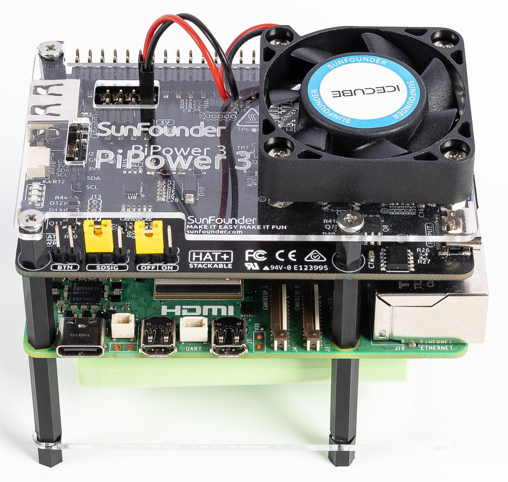

.. note:: 

    Bonjour et bienvenue dans la communauté des passionnés de Raspberry Pi, Arduino et ESP32 de SunFounder sur Facebook ! Plongez plus profondément dans l'univers du Raspberry Pi, Arduino et ESP32 avec d'autres passionnés.

    **Pourquoi nous rejoindre ?**

    - **Support d'experts** : Résolvez vos problèmes après-vente et défis techniques grâce à l'aide de notre communauté et de notre équipe.
    - **Apprendre et partager** : Échangez des astuces et des tutoriels pour améliorer vos compétences.
    - **Aperçus exclusifs** : Accédez en avant-première aux nouvelles annonces de produits et aperçus.
    - **Réductions spéciales** : Profitez de réductions exclusives sur nos derniers produits.
    - **Promotions festives et concours** : Participez à des concours et promotions pendant les fêtes.

    👉 Prêt à explorer et créer avec nous ? Cliquez sur [|link_sf_facebook|] et rejoignez-nous dès aujourd'hui !

SunFounder |link_PiPower| - Protégez votre appareil et vos données
================================================================================

* |link_PiPower_3| 

Merci d'avoir choisi notre |link_PiPower|.

.. note:: 
    Ce document est disponible dans les langues suivantes.

        * |link_german_tutorials|
        * |link_jp_tutorials|
        * |link_en_tutorials|
        * |link_fr_tutorials|
        * |link_es_tutorials|
        * |link_it_tutorials|
    
    Veuillez cliquer sur les liens respectifs pour accéder au document dans la langue de votre choix.

Le PiPower 3 est une solution UPS complète, offrant une gestion du chemin de l'alimentation, la charge et la décharge des batteries lithium double, ainsi que la protection contre la polarité inversée, la surcharge et la décharge profonde.

Il fournit une sortie robuste de 5V/3A et est configuré avec HAT+ pour garantir une compatibilité parfaite avec le Raspberry Pi. Des fonctionnalités supplémentaires incluent une sortie USB Type-A et un connecteur 2x4P pour la sortie d'alimentation, ce qui le rend également adapté à d'autres SBCs, ainsi qu'aux plateformes Arduino et Pico, ESP32.

Un microcontrôleur embarqué gère l'alimentation, et grâce à la communication I2C, il peut surveiller la tension d'entrée, la tension de sortie, la tension de la batterie, le niveau de la batterie, si l'alimentation externe est connectée, l'état de la charge, et si l'alimentation est fournie par la batterie ou par USB.

Le PiPower 3 garantit que vos projets restent alimentés avec une gestion de batterie de pointe et une compatibilité polyvalente, en faisant un outil essentiel pour tout passionné de technologie souhaitant améliorer son matériel.

**Caractéristiques**

* **Entrée** : 5V/3A, USB Type-C avec prise en charge PD
* **Sortie** : 5V/3A, compatible avec les GPIO du Raspberry Pi, USB Type-A, et un connecteur 2x4P 2.54
* **Puissance de charge** : 7.4V/1A
* **Spécifications de la batterie** : 7.4V 2 cellules 18650 Li-ion, connecteur XH2.54 3P
* Cavalier par défaut pour l'activation, extension pour bouton externe, cavalier pour signal d'arrêt
* Indicateurs embarqués pour le niveau de la batterie, la source d'entrée, l'état de l'alimentation, la polarité inversée et la puissance de sortie
* Microcontrôleur RISC-V 32 bits embarqué, prenant en charge la communication I2C
* **Interfaces de communication I2C** : GPIO du Raspberry Pi, SH1.0 4P (compatible avec Qwiic, STEMMA QT), et connecteur 1x4P 2.54

**Contenu**

.. toctree:: 
    :maxdepth: 2

    About this Kit <self>
    assembly_instructions
    quick_user_guide
    hardware_introduction
    battery
    fan
    compatible_sbc

**Avis de copyright**

Tous les contenus, y compris mais sans s'y limiter, les textes, images et codes présents dans ce manuel, sont la propriété de la société SunFounder. Vous ne devez les utiliser que pour des études personnelles, des recherches, des loisirs ou d'autres fins non commerciales ou non lucratives, conformément aux réglementations et lois sur les droits d'auteur, sans enfreindre les droits légaux de l'auteur et des titulaires de droits. Pour toute personne ou organisation utilisant ces éléments à des fins commerciales sans autorisation, la société se réserve le droit d'engager des actions en justice.

