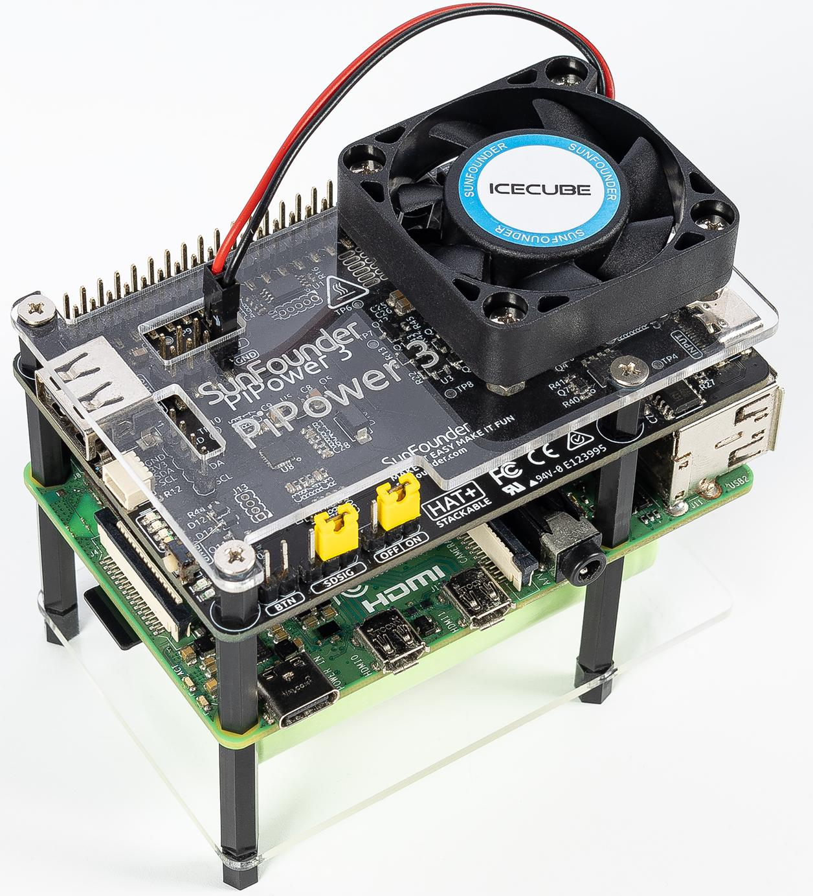

.. note::

    こんにちは、SunFounderのRaspberry Pi & Arduino & ESP32愛好家コミュニティへようこそ！Facebook上でRaspberry Pi、Arduino、ESP32についてもっと深く掘り下げ、他の愛好家と交流しましょう。

    **参加する理由は？**

    - **エキスパートサポート**：コミュニティやチームの助けを借りて、販売後の問題や技術的な課題を解決します。
    - **学び＆共有**：ヒントやチュートリアルを交換してスキルを向上させましょう。
    - **独占的なプレビュー**：新製品の発表や先行プレビューに早期アクセスしましょう。
    - **特別割引**：最新製品の独占割引をお楽しみください。
    - **祭りのプロモーションとギフト**：ギフトや祝日のプロモーションに参加しましょう。

    👉 私たちと一緒に探索し、創造する準備はできていますか？[|link_sf_facebook|]をクリックして今すぐ参加しましょう！

SunFounder PiPower 3 - デバイスとデータを保護する
================================================================================

PiPower 3をお選びいただきありがとうございます。

.. note::
    このドキュメントは以下の言語で利用できます。

        * |link_german_tutorials| （ドイツ語）
        * |link_jp_tutorials| （日本語）
        * |link_en_tutorials| （英語）
    
    希望の言語でドキュメントにアクセスするには、各リンクをクリックしてください。

PiPower 3は、デュアルリチウムバッテリーの充電および放電、逆極性保護、過充電保護、深放電保護などを備えた包括的なUPSソリューションです。

5V/5Aの強力な出力を提供し、Raspberry Pi 5との完全な互換性を確保するためにHAT+で構成されています。追加機能には、USB Type-A出力や2x4Pヘッダーによる電源出力が含まれ、他のSBC、Arduino、Pico、ESP32プラットフォームにも適しています。

オンボードマイクロコントローラーが電源のオン/オフを管理し、I2C通信を通じて入力電圧、出力電圧、バッテリー電圧、バッテリーレベル、外部電源の接続状況、充電状態、バッテリーまたはUSBによる電源供給の有無を監視できます。

PiPower 3は、最先端のバッテリー管理と多用途の互換性を備え、ハードウェアセットアップを向上させたいテクノロジー愛好家にとって不可欠なツールです。

**特徴**

* **入力**: 5V/5A, PD対応USB Type-C
* **出力**: 5V/5A, Raspberry Pi GPIO、USB Type-A、2x4P 2.54ヘッダーに対応
* **充電電力**: 7.4V/1A
* **バッテリー仕様**: 7.4V 2セル 18650リチウムイオン、XH2.54 3Pコネクタ
* デフォルトオンジャンパーキャップ、外部ボタン拡張ヘッダー、シャットダウン信号ジャンパー
* バッテリーレベル、入力ソース、電源状態、逆極性、および出力電力のオンボードインジケーター
* I2C通信をサポートするオンボード32ビットRISC-Vマイクロコントローラー
* **I2C通信インターフェース**: Raspberry Pi GPIO、SH1.0 4P（Qwiic、STEMMA QT互換）、1x4P 2.54ヘッダー

**内容**

.. toctree::
    :maxdepth: 2

    About this Kit <self>
    assembly_instructions
    quick_user_guide
    hardware_introduction
    battery
    fan
    compatible_sbc

**著作権表示**

このマニュアルに含まれるテキスト、画像、コードなどのすべてのコンテンツはSunFounder Companyの所有物です。関連する規制および著作権法の下で、個人の学習、調査、楽しみ、またはその他の非営利目的のためにのみ使用する必要があり、著者および関連する権利者の法的権利を侵害しないようにしてください。許可なくこれらを商業目的で使用する個人または組織に対して、当社は法的措置を取る権利を有します。
