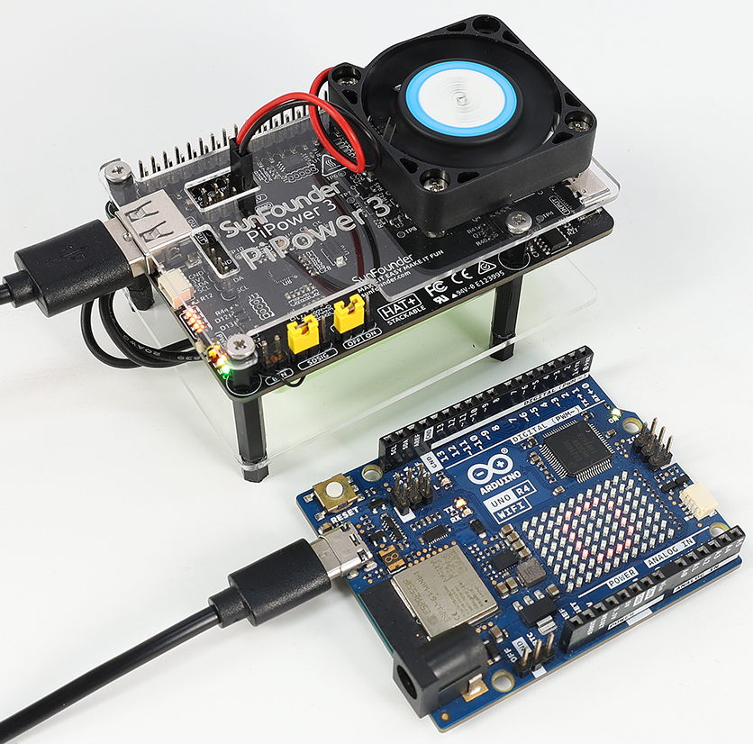
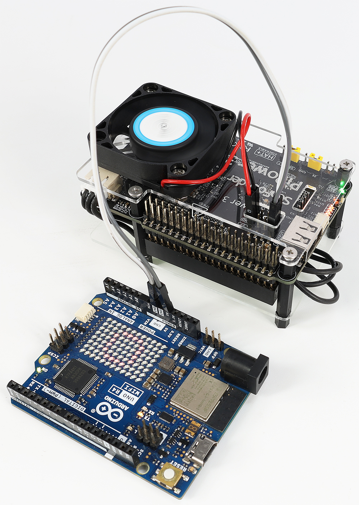
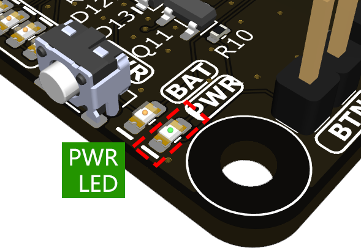

Quick User Guide
=======================
Pinout
------------

.. image:: img/pipower3_pinout.png
  :width: 800
  :align: center

1. :ref:`power_input`: External power input, can directly power Raspberry Pi while charging the battery.
2. :ref:`cap_onoff`: Select whether to automatically start when the external power input is plugged in during the shutdown state.
3. :ref:`cap_sdsig`: Shutdown signal, shorting pin 26 connects to the Raspberry Pi's GPIO26. After setting up this signal, the Raspberry Pi will shut down, and the signal will instruct the onboard MCU to power off.
4. :ref:`cap_btn`: External power button jumper, used for external power button.
5. **PWR LED**: Output status LED, lights up when output is activated.
6. **BAT LED**: Indicates whether the battery is currently powering externally. If the LED is on, the battery is in use; monitor battery consumption.
7. :ref:`power_button`: Onboard power button for controlling the board's power:

  * **Single press**: Activates output.
  * **Hold for 2 seconds, until the middle two battery LEDs light up then release**: Sends shutdown request via i2c.
  * **Continue holding for more than 5 seconds**: Directly turns off output.

8. :ref:`battery_indicators`: Indicates battery level and charging status.
9. **I2C Connector**: SH1.0 4P terminal, compatible with **qwIIC** and **STEMMA QT**.
10. **I2C Pin Headers**: 1x4P 2.54 pin headers.
11. **Type A Output**: 5V output interface.
12. **5V/GND Pin Headers**: 2 x 4P 2.54 pin headers.
13. :ref:`pin_header`: Raspberry Pi pin headers, directly connects to the Raspberry Pi.
14. :ref:`battery_connector`: XH2.54 3P battery connector.
15. **Warning LEDs**: If the battery is reversed, two red LEDs light up, warning of battery reversal.

Operating Steps
------------------

1. Charge the PiPower 3.

Before using your PiPower 3, charge it fully. A full charge prevents battery issues and ensures optimal performance.

For charging, use a 5V/5A PD charger, such as the official Raspberry Pi 27W power supply. This allows the PiPower 3 to deliver a maximum current of 5A. 

.. image:: img/power_input.jpg
  :width: 500
  :align: center

You'll see the indicator light blink during charging.

.. image:: img/battery_indicator.jpg
  :width: 500
  :align: center

* **4 LEDs lit**: Battery >80%
* **3 LEDs lit**: 60%< Battery <80%
* **2 LEDs lit**: 40%< Battery <60%
* **1 LED lit**: 20%< Battery <40%
* **First LED flashing**: Battery <20%
* **LEDs incrementally light up in a cycle**: Charging
* **Middle two LEDs flashing**: Waiting for shutdown signal
* **All LEDs off**: Unpowered or in sleep mode

2. Output power to the mainboard.

If you're using a Raspberry Pi, no additional wiring is necessary.

For other mainboards, you can connect them to PiPower 3's Type A output port or use two jump wires.

3. Press the power button once to power your mainboard. 

You will see the **PWR LED** light up, and your mainboard will receive power from PiPower 3.

4. To turn off the power after use.

  * **Continue holding for more than 5 seconds**: Directly turns off the output.
  * **Hold for 2 seconds, until the middle two battery LEDs light up then release**: If you have configured the :ref:`pipower_software`, this action sends a shutdown request via I2C for a safe shutdown.

.. note::

    When your Type C power cable is still plugged in, the battery indicator will continue to display the charging status until charging is complete.

.. _pipower_software:

Software Configuration
------------------------------------

In addition to using the PiPower 3 directly, you can also utilize our provided library to monitor input and output voltages, current, battery voltage, percentage, power source, charging status, and other internal data such as shutdown requests.

Please choose the appropriate tutorial based on your mainboard.

.. toctree::
    :maxdepth: 2

    use_with_rpi
    use_with_pico_esp32
    use_with_arduino

    
