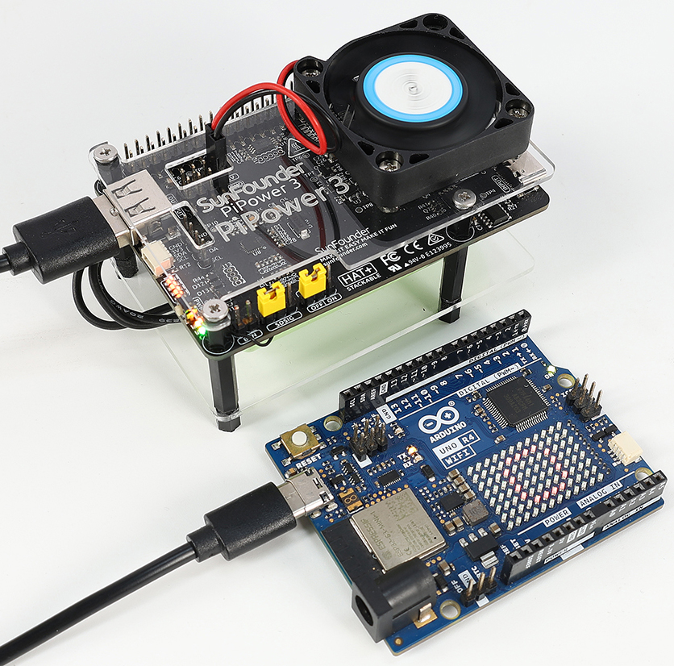
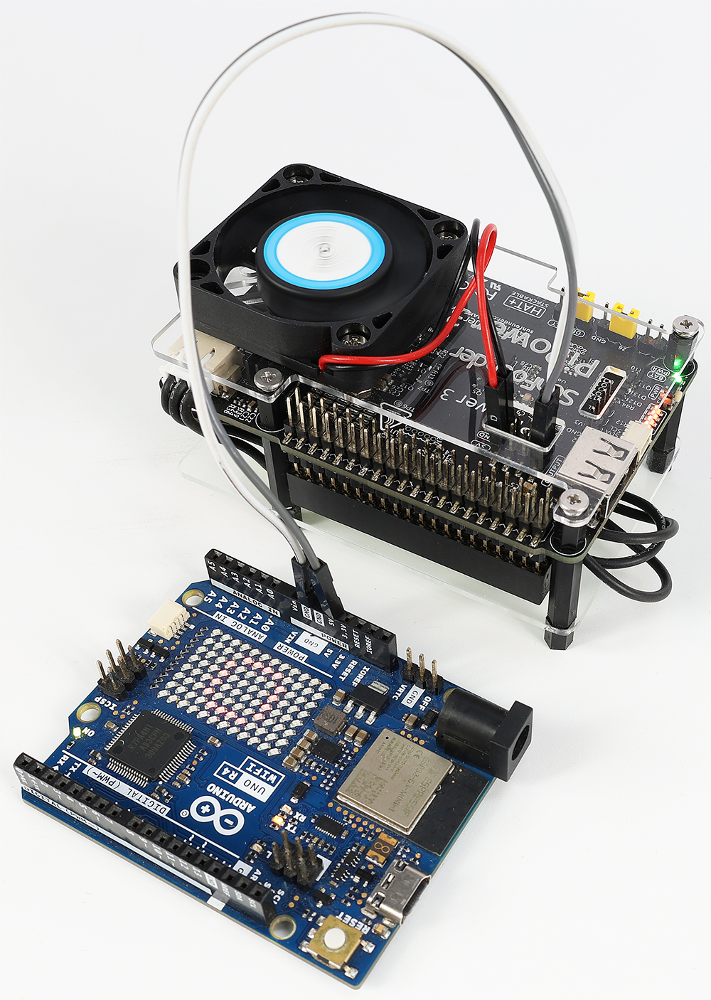
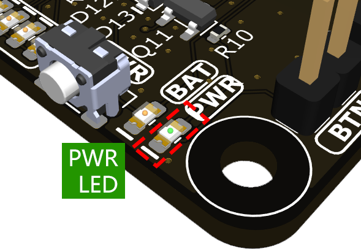

.. note:: 

    Bonjour et bienvenue dans la communauté des passionnés de Raspberry Pi, Arduino et ESP32 de SunFounder sur Facebook ! Plongez plus profondément dans l'univers du Raspberry Pi, Arduino et ESP32 avec d'autres passionnés.

    **Pourquoi nous rejoindre ?**

    - **Support d'experts** : Résolvez vos problèmes après-vente et défis techniques grâce à l'aide de notre communauté et de notre équipe.
    - **Apprendre et partager** : Échangez des astuces et des tutoriels pour améliorer vos compétences.
    - **Aperçus exclusifs** : Accédez en avant-première aux nouvelles annonces de produits et aperçus.
    - **Réductions spéciales** : Profitez de réductions exclusives sur nos derniers produits.
    - **Promotions festives et concours** : Participez à des concours et promotions pendant les fêtes.

    👉 Prêt à explorer et créer avec nous ? Cliquez sur [|link_sf_facebook|] et rejoignez-nous dès aujourd'hui !

Guide d'utilisateur rapide
============================
Pinout
------------

.. image:: img/pipower3_pinout.png
  :width: 800
  :align: center

1. :ref:`power_input` : Entrée d'alimentation externe, peut alimenter directement le Raspberry Pi tout en chargeant la batterie.
2. :ref:`cap_onoff` : Sélectionnez si le démarrage automatique doit se faire lorsque l'alimentation externe est branchée en état d'arrêt.
3. :ref:`cap_sdsig` : Signal d'arrêt, connecter la broche 26 à la broche centrale avec un cavalier permet de connecter **SDSIG** à GPIO26 sur le Raspberry Pi. Une fois configuré, si le Raspberry Pi s'arrête, GPIO26 devient haut, signalant à PiPower 3 de s'éteindre.
4. :ref:`cap_btn` : Cavalier pour bouton d'alimentation externe, utilisé pour un bouton d'alimentation externe.
5. **PWR LED** : LED d'état de la sortie, s'allume lorsque la sortie est activée.
6. **BAT LED** : La LED qui s'allume indique que la batterie fournit actuellement de l'énergie. À ce moment-là, vous devez surveiller le niveau de la batterie pour éviter tout dommage dû à une décharge excessive.
7. :ref:`power_button` : Bouton d'alimentation intégré pour contrôler l'alimentation de la carte :

  * **Pression simple** : Active la sortie.
  * **Maintenez pendant 2 secondes, jusqu'à ce que les deux LED de batterie du milieu s'allument, puis relâchez** : Envoie une demande d'arrêt via i2c.
  * **Continuez à maintenir pendant plus de 5 secondes** : Éteint directement la sortie.

8. :ref:`battery_indicators` : Indique le niveau de la batterie et l'état de la charge.
9. **Connecteur I2C** : Connecteur SH1.0 4P, compatible avec **qwIIC** et **STEMMA QT**.
10. **Broches I2C** : Broches 1x4P 2.54.
11. **Sortie Type A** : Interface de sortie 5V.
12. **Broches 5V/GND** : 2 x 4P 2.54 broches.
13. :ref:`pin_header` : Broches du Raspberry Pi, se connecte directement au Raspberry Pi.
14. :ref:`battery_connector` : Connecteur de batterie XH2.54 3P.
15. **LEDs d'avertissement** : Si la batterie est inversée, deux LED rouges s'allument, avertissant de l'inversion de la batterie.

Étapes de fonctionnement
--------------------------

1. Chargez le PiPower 3.

Avant d'utiliser votre PiPower 3, chargez-le complètement. Une charge complète permet d'éviter des problèmes de batterie et garantit des performances optimales.

Pour la charge, utilisez un chargeur PD 5V/3A, tel que l'alimentation officielle Raspberry Pi 27W. Cela permet au PiPower 3 de délivrer un courant maximal de 3A.

.. image:: img/power_input.jpg
  :width: 500
  :align: center

L'indicateur clignotera pendant la charge.

.. image:: img/battery_indicator.jpg
  :width: 500
  :align: center

* **4 LED allumées** : Batterie >80%
* **3 LED allumées** : 60% < Batterie < 80%
* **2 LED allumées** : 40% < Batterie < 60%
* **1 LED allumée** : 20% < Batterie < 40%
* **Première LED clignotante** : Batterie < 20%
* **Les LED s'allument progressivement dans un cycle** : En charge
* **Les deux LED du milieu clignotent** : En attente du signal d'arrêt
* **Toutes les LED éteintes** : Hors tension ou en mode veille

2. Fournir de l'alimentation à la carte principale.

Si vous utilisez un Raspberry Pi, aucune connexion supplémentaire n'est nécessaire.

Pour d'autres cartes principales, vous pouvez les connecter au port de sortie Type A de PiPower 3 ou utiliser deux fils de connexion.

3. Appuyez une fois sur le bouton d'alimentation pour alimenter votre carte principale.

Vous verrez la **PWR LED** s'allumer, et votre carte principale recevra de l'alimentation de PiPower 3.

4. Pour éteindre l'alimentation après utilisation.

  * **Continuez à maintenir pendant plus de 5 secondes** : Éteint directement la sortie.
  * **Maintenez pendant 2 secondes, jusqu'à ce que les deux LED de batterie du milieu s'allument, puis relâchez** : Si vous avez configuré le :ref:`pipower_software`, cette action envoie une demande d'arrêt via I2C pour un arrêt sécurisé.

.. note::

    Lorsque votre câble d'alimentation Type C est toujours branché, l'indicateur de batterie continuera d'afficher l'état de charge jusqu'à ce que la charge soit terminée.

.. _pipower_software:

Configuration logicielle
------------------------------------

En plus d'utiliser le PiPower 3 directement, vous pouvez également utiliser notre bibliothèque fournie pour surveiller les tensions d'entrée et de sortie, le courant, la tension de la batterie, le pourcentage, la source d'alimentation, l'état de charge et d'autres données internes telles que les demandes d'arrêt.

Veuillez choisir le tutoriel approprié en fonction de votre carte principale.

.. toctree:: 
    :maxdepth: 2

    use_with_rpi
    use_with_pico_esp32
    use_with_arduino

    
