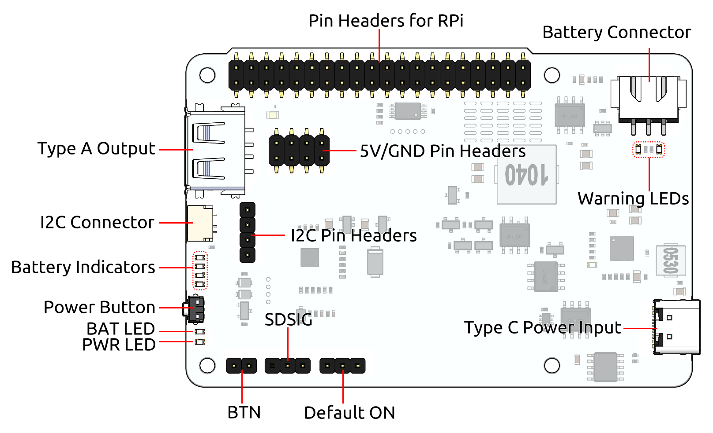

.. note::

    こんにちは、SunFounderのRaspberry Pi & Arduino & ESP32愛好家コミュニティへようこそ！Facebook上でRaspberry Pi、Arduino、ESP32についてもっと深く掘り下げ、他の愛好家と交流しましょう。

    **参加する理由は？**

    - **エキスパートサポート**：コミュニティやチームの助けを借りて、販売後の問題や技術的な課題を解決します。
    - **学び＆共有**：ヒントやチュートリアルを交換してスキルを向上させましょう。
    - **独占的なプレビュー**：新製品の発表や先行プレビューに早期アクセスしましょう。
    - **特別割引**：最新製品の独占割引をお楽しみください。
    - **祭りのプロモーションとギフト**：ギフトや祝日のプロモーションに参加しましょう。

    👉 私たちと一緒に探索し、創造する準備はできていますか？[|link_sf_facebook|]をクリックして今すぐ参加しましょう！

クイックユーザーガイド
=======================
ピン配置
------------

1. :ref:`power_input`: 外部電源入力。バッテリーの充電中に直接Raspberry Piに電力を供給します。
2. :ref:`cap_onoff`: シャットダウン状態で外部電源入力が接続された時に自動的に起動するかどうかを選択します。
3. :ref:`cap_sdsig`: シャットダウン信号。ピン26をジャンパーキャップで中央ピンに接続し、 **SDSIG** をRaspberry PiのGPIO26に接続します。設定後、Raspberry PiがシャットダウンするとGPIO26が高電位になり、PiPower 3に電源を切る信号を送ります。
4. :ref:`cap_btn`: 外部電源ボタン用のジャンパー。外部電源ボタンを使用します。
5. **PWR LED**: 出力ステータスLED。出力がアクティブになると点灯します。
6. **BAT LED**: バッテリーが現在電力を供給していることを示します。この時、過放電による損傷を防ぐためにバッテリーレベルを監視する必要があります。
7. :ref:`power_button`: ボードの電源を制御するオンボードの電源ボタン。

  * **短押し**: 出力をアクティブにします。
  * **2秒間押し続け、中央の2つのバッテリーLEDが点灯したら放す**: i2c経由でシャットダウン要求を送信します。
  * **5秒以上押し続ける**: 出力を直接オフにします。

8. :ref:`battery_indicators`: バッテリーレベルと充電状態を示します。
9. **I2Cコネクタ**: SH1.0 4P端子。 **qwIIC** および **STEMMA QT** に対応。
10. **I2Cピンヘッダー**: 1x4P 2.54ピンヘッダー。
11. **Type A出力**: 5V出力インターフェース。
12. **5V/GNDピンヘッダー**: 2 x 4P 2.54ピンヘッダー。
13. :ref:`pin_header`: Raspberry Piピンヘッダー。直接Raspberry Piに接続します。
14. :ref:`battery_connector`: XH2.54 3Pバッテリーコネクタ。
15. **警告LED**: バッテリーが逆接続された場合、2つの赤色LEDが点灯し、逆接続を警告します。

操作手順
------------------

1. PiPower 3を充電する。

PiPower 3を使用する前に、完全に充電してください。完全な充電はバッテリーの問題を防ぎ、最適な性能を確保します。

充電には、5V/5AのPD充電器（公式のRaspberry Pi 27W電源など）を使用してください。これにより、PiPower 3は最大5Aの電流を供給できます。

.. image:: img/power_input.jpg
  :width: 500
  :align: center

充電中はインジケーターライトが点滅します。

.. image:: img/battery_indicator.jpg
  :width: 500
  :align: center

* **4つのLEDが点灯**: バッテリー >80%
* **3つのLEDが点灯**: 60%< バッテリー <80%
* **2つのLEDが点灯**: 40%< バッテリー <60%
* **1つのLEDが点灯**: 20%< バッテリー <40%
* **最初のLEDが点滅**: バッテリー <20%
* **LEDが順番に点灯**: 充電中
* **中央の2つのLEDが点滅**: シャットダウン信号を待っています
* **すべてのLEDが消灯**: 電源が供給されていないか、スリープモード

2. メインボードへの電力供給

Raspberry Piを使用する場合、追加の配線は必要ありません。

他のメインボードの場合、PiPower 3のType A出力ポートに接続するか、ジャンパーワイヤーを2本使用します。

.. image:: img/output_mainboard_pin.jpg
    :width: 400
    :align: center

3. 電源ボタンを1回押してメインボードに電力を供給します。

**PWR LED** が点灯し、メインボードがPiPower 3から電力を受け取ります。

.. image:: img/pwr_led.png
    :width: 500
    :align: center

4. 使用後に電源を切る方法。

  * **5秒以上押し続ける**: 出力を直接オフにします。
  * **2秒間押し続け、中央の2つのバッテリーLEDが点灯したら放す**:  :ref:`pipower_software` を設定している場合、この操作で安全なシャットダウンのためにi2c経由でシャットダウン要求を送信します。

.. note::

    Type C電源ケーブルが接続されたままの場合、バッテリーインジケーターは充電が完了するまで充電状態を表示し続けます。

.. _pipower_software:

ソフトウェアの設定
------------------------------------

PiPower 3を直接使用するだけでなく、提供されているライブラリを利用して入力および出力電圧、電流、バッテリー電圧、パーセンテージ、電源、充電状態、およびシャットダウン要求などの内部データを監視できます。

メインボードに基づいた適切なチュートリアルを選択してください。

.. toctree::
    :maxdepth: 2

    use_with_rpi
    use_with_pico_esp32
    use_with_arduino

    